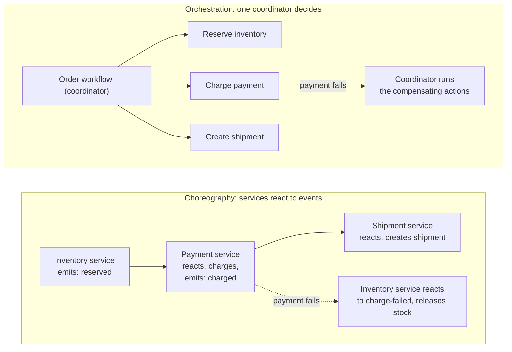

A checkout flow that reserves inventory, charges a card, and creates a shipment touches three services, each with its own database. If the charge succeeds but the shipment service is down, the order is now paid with no shipment record, and nothing rolled back the inventory reservation either. That's not an edge case. Any transaction that crosses a service boundary has this failure mode, because there's no single database transaction wrapping all three writes.

A note on scope: this is a conceptual comparison of two established patterns, not a report from a specific outage. The checkout example above is illustrative, not a real incident, and the mechanics described below are documented independently of any one team's experience with them.

**Short on time?** Jump to [the comparison table](#the-comparison) or [the orchestration vs choreography diagram](#two-ways-to-run-a-saga). Full read: about 8 minutes.

## Two ways to keep a transaction consistent

The database answer to "these three writes must all succeed or all fail" is a transaction. Two-phase commit (2PC) extends that idea across services: a coordinator asks every participant to prepare (lock its resources and confirm it can commit), waits for every participant to vote yes, then tells them all to commit. If any participant votes no, or times out, the coordinator tells everyone to abort instead. It's a real, atomic rollback, the same guarantee a single database gives you.

The cost is in the waiting. Every participant holds its locks from the moment it votes yes until the coordinator's final decision arrives, so a slow network hop or a coordinator that crashes mid-decision leaves every other participant blocked, resources locked, until the coordinator recovers. And in practice, most of the infrastructure a modern system is built on doesn't speak the XA protocol 2PC needs at all: most message brokers, most NoSQL stores, and essentially every third-party API you call over HTTP have no concept of "prepare to commit, then wait for my signal." 2PC isn't just expensive in a microservices system. For most of the participants you'd need to coordinate, it's simply not an option.

## What the saga pattern does instead

The Saga pattern, first described by Garcia-Molina and Salem in 1987 and popularized for microservices by Chris Richardson, gives up atomicity in exchange for not needing any of that. A saga is a sequence of local transactions, each one committed immediately in its own service, with no cross-service lock held at any point. Reserve inventory: commit. Charge the card: commit. Create the shipment: commit. If a later step fails, the saga doesn't roll back the earlier ones. It runs a compensating action for each one instead: release the inventory reservation, refund the charge.

That trade shows up in two places a reader should see stated plainly rather than discovered later. First, there's a window where the system is honestly inconsistent: after the charge commits and before the shipment is created, an inventory reservation and a completed charge both exist for an order that isn't shipped yet, and anything reading that state during the window sees it. Second, "compensating action" is doing a lot of work in that sentence. Releasing an inventory reservation is a true undo. Refunding a charge is close to one. But some steps don't have an undo at all: once a confirmation email has gone out, there's no un-sending it, only a second email that says something changed. Designing the compensating action is often harder than designing the original step, and it's the part of adopting Saga that's easiest to underestimate.

## Two patterns, weighed once you have both

### The comparison

| Trait | Two-phase commit | Saga |
|---|---|---|
| Consistency guarantee | Strong: all commit, or all roll back | Eventual: a real window of partial state exists |
| Locking | Every participant locks its resources until the coordinator resolves | No cross-service locks; each local transaction commits immediately |
| Infrastructure required | Every participant must support the XA/2PC protocol | Works with anything that can publish an event or expose a compensating action |
| Coordinator failure | Every participant stays blocked, still holding locks, until the coordinator recovers | No coordinator to fail (choreography), or the workflow resumes from its event history (orchestration) |
| Undo mechanism | A true rollback | A compensating action, which is sometimes approximate, not always a true undo |

Read the table as a filter, not a scoreboard: if your participants don't support XA (most don't), 2PC is disqualified before the consistency-versus-availability trade-off even comes up.

## Two ways to run a saga

Once a system commits to sagas, there's a second decision hiding underneath it: who decides what happens next. Orchestration puts a central coordinator in charge, a workflow that explicitly calls "reserve inventory," then "charge payment," then "create shipment," and runs the compensating actions itself if a step fails. A [Temporal workflow](/posts/when-to-adopt-temporal/) is exactly this: the workflow code is the coordinator, and its event history is the audit trail of which step the saga reached.

Choreography has no coordinator at all. Each service reacts to events the others emit: the inventory service reserves stock and emits `reserved`, the payment service listens for that event, charges the card, and emits `charged`, the shipment service listens for `charged` and creates the shipment. If the charge fails, the payment service emits `charge-failed`, and the inventory service listens for that and releases the reservation.

Choreography avoids a single coordinator, which sounds like a pure win until the saga grows past three steps. Nobody owns the sequence, so "what happens after a payment fails" is answered by finding every service subscribed to that event and reading each one's handler, the same archaeology problem a hand-rolled retry system has when nothing wrote down where a process got to. Orchestration keeps that answer in one place, the workflow definition, at the cost of a coordinator your team now runs.

## Where people usually push back

### Isn't two-phase commit just the correct answer, though?

In principle, yes: it's a strictly stronger consistency guarantee than a saga ever gives you. In practice, it requires every participant to speak a protocol that most modern infrastructure never implemented, so the choice usually isn't "strong consistency or eventual consistency." It's "eventual consistency, or a coordination protocol most of your dependencies can't participate in at all."

### Do compensating actions always work?

No. Some are true undos (release a reservation), some are close enough (refund a charge), and some are only ever a second action that acknowledges the first one happened (a follow-up email, not an unsent one). Any saga design has to name which compensations are real undos and which are approximations the business has to accept.

### Does choosing Saga mean giving up consistency entirely?

No, it means the consistency arrives later instead of atomically. That's still a guarantee, eventual consistency, just one that requires the rest of the system (especially anything reading state mid-saga) to tolerate a window where the picture is incomplete.

## So what

Two-phase commit gives you atomicity, but it's rarely available in a system built from message brokers, managed databases, and third-party APIs, none of which speak XA. Saga is usually the only real option once a transaction crosses those boundaries, and the actual work is in designing honest compensating actions and picking orchestration or choreography deliberately rather than by default. Orchestration centralizes that decision in a workflow (Temporal is one way to build that workflow); choreography spreads it across event handlers, and is easiest to reason about only while the saga stays small.

If you're mapping this onto a transaction your team already owns and want a second opinion on where the compensating actions get hard, more on how I work is on the [about page](/about).
