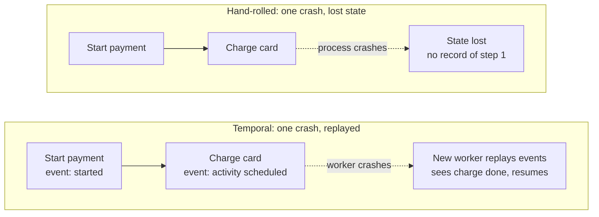
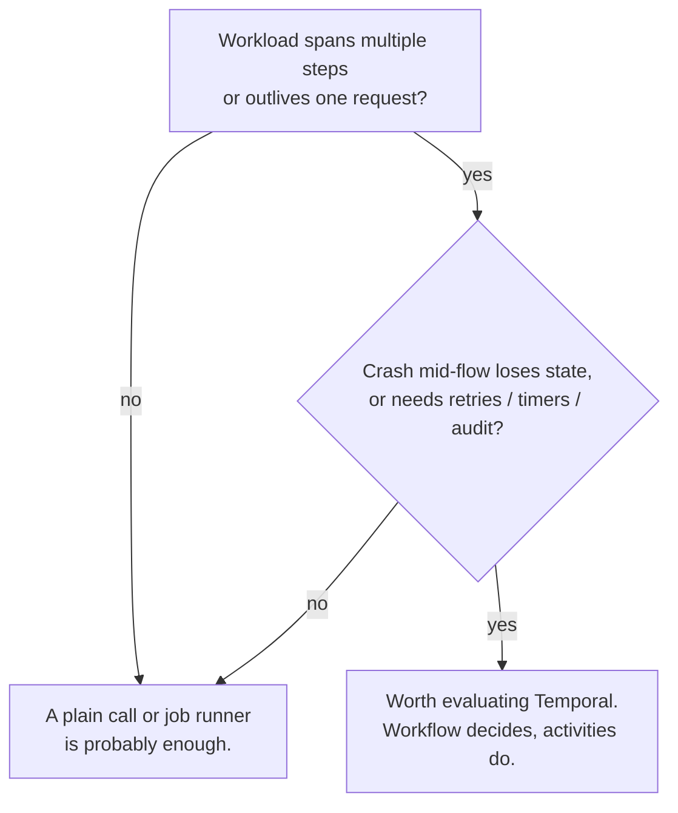

Somewhere in your stack there's a payment flow that died between "card charged" and "order marked paid," and nothing remembers the gap. Or a "remind the customer in 48 hours" job that lived in a scheduler's memory until the scheduler restarted. Or an onboarding that spans five services and three days, and the only way to answer "where is it now?" is grepping logs across all five and reconstructing the timeline by hand. None of these are exotic failures. They're the standard cost of building long-running business processes out of queues, cron jobs, and status tables, and every team that does it long enough hits all three.

Temporal is the platform built to remove that cost. This piece is how to think about whether it's worth adopting, for whoever signs off on adding a platform and whoever has to run it.

**Short on time?** Jump to [the fit table](#the-fit-table) or [the five-question checklist](#the-five-question-checklist): either one answers "does this apply to us" in under a minute. Full read: about 9 minutes.

A scope note up front: this is a decision framework built from Temporal's own [evaluation and design-pattern documentation](https://docs.temporal.io/temporal) as of September 2026, not a report from a production adoption of ours. The four failure patterns below are ones we've seen in hand-rolled systems; the Temporal side of the comparison is what the platform's own model claims to do. Judge it on the reasoning, not on a case study we don't have.

## What actually breaks today

Four failure patterns show up in almost every hand-rolled attempt at reliability:

- **Crashed mid-process state.** The process holding the in-flight state dies, and recovery is either manual or a mystery, because nothing wrote down where it got to.
- **Retry storms.** Every service implements its own retry with its own backoff, they stack on top of each other, and the system does its most work during its worst hour.
- **Lost timers.** A delayed job lives in a scheduler's memory. The scheduler restarts, the timer disappears, and no one notices for weeks.
- **No visibility into long-running flows.** There's no single place that answers "what state is this in." The answer is an archaeology project across logs.

Fixing this yourself means building and maintaining four subsystems that aren't your product: a queue or event bus, a status table plus the code that keeps it truthful, a scheduler with catch-up logic, and locks or dedup keys scattered across every service that touches the same business entity. None of that is business logic. All of it is code your team tests, monitors, and gets paged for.

Temporal's model treats a workflow execution as a state machine you can read like a database. Every transition (started, step one done, timer set, step two failed, retried) [gets written down as an event](https://docs.temporal.io/temporal) before the next step runs. The process's current state isn't trapped in some process's memory; it's rows in a log you can query. A crashed worker loses nothing, because a new worker replays the log and resumes from the last recorded transition.

## What it costs, and what it buys back

Put in terms a budget owner cares about, the trade-off is simpler than the engineering framing makes it sound: every hour your engineers spend hand-rolling retries, timers, and recovery logic is an hour not spent on the product, and it's recurring: that plumbing needs maintenance and gets paged just like anything else in production. Moving failure handling from application code into a platform is a bet that the platform's operational cost is smaller than the engineering cost of reinventing it four times, once per team that owns a long-running process. It's a bet, not a given. The rest of this section is what's on both sides of it.

A budget owner can check three things without reading code. "Where is order 4711, and what happened at each step" becomes a lookup against the Event History instead of a support ticket that costs an engineer an afternoon. A process that would have died quietly in a scheduler's memory now has a durable record and a retry policy, so the class of incident that used to surface as a customer complaint three weeks later mostly stops happening. And once the platform exists, the next multi-day process (a claim, a payout, an approval chain) doesn't require redesigning the same four subsystems again; it reuses infrastructure that already works.

None of this is free, and stating the costs plainly matters more than making the case sound good. The costs land on engineering, but a budget owner should see them stated clearly before signoff, not discover them after.

Running the platform is real work either way. A [self-hosted deployment](https://docs.temporal.io/self-hosted-guide) means a Temporal Service, a database it depends on, and Workers your team deploys, scales, and rolls out: full control, and the full operational bill for that control. A [Temporal Cloud](https://temporal.io/cloud) subscription trades that operational bill for a recurring cost and less control over the database and cluster underneath you. Neither is the "correct" default; it's the same build-versus-buy trade-off your team has almost certainly made before for other infrastructure, and it comes out differently depending on how much ops capacity you already have sitting idle versus how tight the budget is. Even the local dev server is one more moving part than a function call. Workflow code also has to be a pure function of its event history, which is a real constraint on how your team writes code, with a learning curve attached. The first time someone calls `time.Now()` or generates a random ID directly inside workflow code, replay breaks in a way that looks exactly like the bug this platform was supposed to remove. Congratulations, you've reinvented nondeterminism inside the tool built to kill it. And each state transition is a persisted event: fine for a business process with a handful of steps, expensive for a hot per-request loop.

## When it fits, and when it's the wrong tool

The trait that predicts fit isn't "is this important." It's whether the workload has the shape durable execution actually solves.

### The fit table

| Trait of the workload | Fits Temporal? |
|---|---|
| Runs longer than one request (minutes to months) | Strong fit |
| Multiple steps across services or humans | Strong fit |
| Needs retries with backoff and per-step timeouts | Strong fit |
| Needs an audit of every step | Strong fit |
| Must survive deploys and restarts mid-flight | Strong fit |
| Work arrives on a schedule or with deadlines | Fit |
| Single request-reply call that usually just works | Poor fit |
| Pure throughput: transform a stream, per item | Poor fit |
| Tiny CRUD behind an API | Poor fit |
| Hard real-time or sub-millisecond paths | Poor fit |

### The five-question checklist

Say yes to any one of these, and there's a workflow-shaped problem worth writing down:

1. Would a crash mid-process lose state that only exists in memory?
2. Does a human or another service need to respond hours or days later?
3. Do you write catch-up logic for things that should have happened on a schedule?
4. Is "what state is this order in?" answered by grepping logs?
5. Do you hand-roll retry-and-backoff logic in more than one place?

And the cases where adopting it produces a worse system than not adopting it, stated plainly rather than left implicit: a single API call that already succeeds 99.9% of the time doesn't need a workflow, a history, and a replay just to save one retry block. A high-frequency stateless transform on a stream shouldn't pay a persisted-event cost per item. Keep the stream in streaming infrastructure and start workflows only for the processes the stream triggers. A script that runs nightly and fails loudly is already fine; Temporal's Schedule API earns its cost only when a missed run has to be caught up, not just alerted on. And a synchronous request inside one service boundary, where the caller is waiting milliseconds, is simpler as a direct call. Durable execution shines when the wait spans restarts measured in hours or days, not milliseconds.

## Where this actually shows up

Across every industry that's adopted it, the same recurring job shapes keep reappearing: a long-running lifecycle that must survive crashes in every state, a step that blocks on human approval with an escalation deadline, a multi-service transaction that must undo earlier steps if a late step fails, an external call that must never fire twice. A payment payout is a lifecycle plus a compensating-transaction saga plus an idempotent external call. An insurance claim is a lifecycle plus an approval with a deadline. A marketplace booking is one long-lived entity plus a buyer-confirmation step plus a cancellation window. Different industries, same handful of shapes wearing different cloth. That's exactly why the fit question above generalizes across payments, insurance, mobility, security operations, and infrastructure automation rather than being specific to any one of them.

## Where people usually push back

### Does this replace my job queue or message broker?

No. A job queue moves work; Temporal decides what work happens next based on the state of a specific business process. Keep your queue or stream for pure throughput. A per-item transform with no cross-step state doesn't need a workflow, a history, or a replay. Start a Temporal workflow only for the longer-lived process that queue triggers, if that process itself needs retries, timers, or an audit trail.

### Should we start with Temporal Cloud or self-hosted?

Neither answer is right by default. It's the same build-versus-buy question your team has answered before for a database or a message queue, applied here. Self-hosting keeps the operational cost but gives full control over the database and Worker fleet; Cloud trades that cost for a subscription and less control over the layer underneath you. What tips it one way or the other is whatever your team would normally weigh for infrastructure like this: existing ops capacity, budget shape, and how much new operational surface you want to take on at the same time as the workflow rewrite itself.

### Does adopting this mean rewriting existing services?

Not the services that do the actual work. Workflow code (the part that has to be a deterministic, replayable function of its event history) is a new orchestration layer. The activities it calls can be thin wrappers around your existing services, largely unchanged. What changes is where the retry, timer, and state-tracking logic lives: it moves out of those services and into the workflow, which is the point.

## So what

The pattern worth noticing: this tends to make sense when a process genuinely spans time, steps, and failure modes that already cost you an on-call rotation and a support queue to paper over. The trade, then, is moving that cost from application code your team maintains forever into a platform that has already solved it. It tends not to make sense for a call that already works, a stream that's already fast, or a cron job nobody's ever lost sleep over. There the platform's operational weight is a cost with no matching return.

Score your own workload against the table and checklist above, not against how compelling this piece has been. The answer will look different from one system to the next, and it should.

If you're working through that table for your own systems, or you've already decided and want a second opinion on the self-hosted-versus-Cloud call or sizing the Worker fleet, feel free to reach out. More on how I work is on the [about page](/about).
